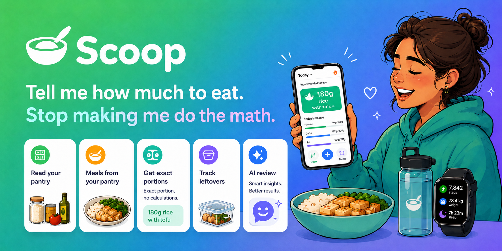

# Scoop

**Tell me how much to eat. Stop making me do the math.**

You want rice with dinner. How many grams fit your macros today? Weigh, type,
guess. Every meal. Annoying. Most people quit tracking because of it.

Scoop flips it. You don't tell the app what you ate — the app tells you what to
eat. It knows your body, your goal, your pantry, and what you ate today, then
hands you the portion: *"180g rice with the chicken."* You just eat it.

Phone-first. Big buttons. Almost no typing.

## Problems it kills

- **"How much can I eat?"** → exact portion to hit your macros. No math.
- **"Too much typing."** → scan a barcode, tap a favourite, snap a photo.
- **"Cooked a big batch — now what?"** → log it once, track what's left all week.
- **"What can I make with what I have?"** → meals from your pantry that fit your diet.
- **"Am I making progress?"** → watches weight, waist, and activity together, so
  a flat scale with a shrinking waist counts as the win.

## What it does

- **Tells you the portion** — grams of each food to hit today's macros. The point.
- **Sets your targets** — from your body stats and activity. No calculators.
- **Easy food input** — barcode, favourites, saved meals, label photo, or a
  grocery screenshot the AI reads.
- **Batch cooking** — log packs + cooked weight; it tracks per-gram macros and
  the leftover.
- **Pantry** — knows the food you have, filled by barcode and receipt scans.
- **Plan a meal** — pick a carb, pick a protein from pictures; it suggests dishes
  from your pantry.
- **Import a recipe** — paste a URL or screenshot; AI reads it, scales it to your macros.
- **One-tap logging** — daily weight; weekly waist / arms / thighs / hips.
- **The Coach** — weekly review of weight, measurements, activity, and food, then
  adjusts your macros and explains why in plain words.
- **Auto body data** — pulls activity and sleep from Fitbit and Apple Watch.

## Built with

Next.js · Tailwind · Supabase · Vercel · Anthropic API (bring your own key) ·
Open Food Facts.

See [`CLAUDE.md`](./CLAUDE.md) for the full plan and build phases.
